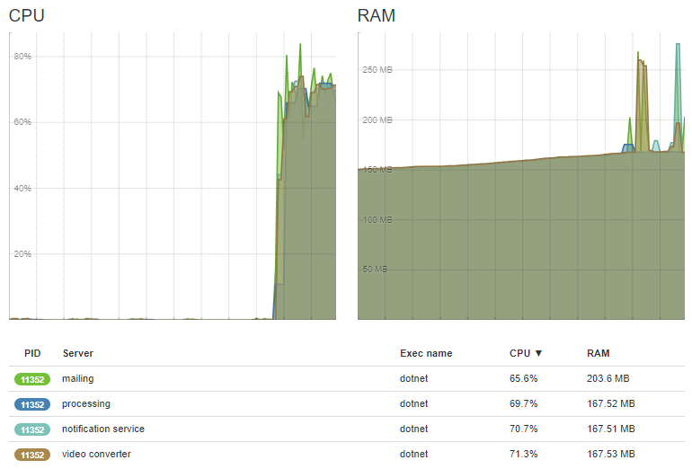

# Hangfire.Heartbeat
[](https://www.nuget.org/packages/Hangfire.Heartbeat/)
[](https://ci.appveyor.com/project/ahydrax/hangfire-heartbeat)



A simple server monitoring plugin for Hangfire.
Read about hangfire here: https://github.com/HangfireIO/Hangfire#hangfire-
and here: http://hangfire.io/

# Instructions
Install a package from Nuget.

Then add this in your code:

for service side:
```csharp
app.UseHangfireServer(additionalProcesses: new[] { new SystemMonitor() });
```

for dashboard:
```csharp
services.AddHangfire(configuration => configuration.UseHeartbeatPage());
```

# License
Authored by: Viktor Svyatokha (ahydrax)
This project is under MIT license. You can obtain the license copy [here](https://github.com/ahydrax/Hangfire.Heartbeat/blob/master/LICENSE).